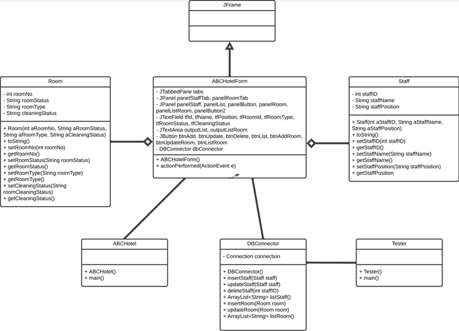
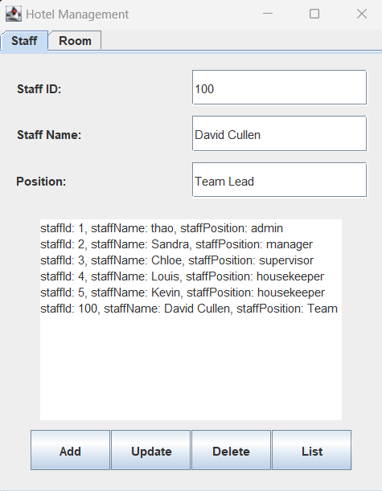
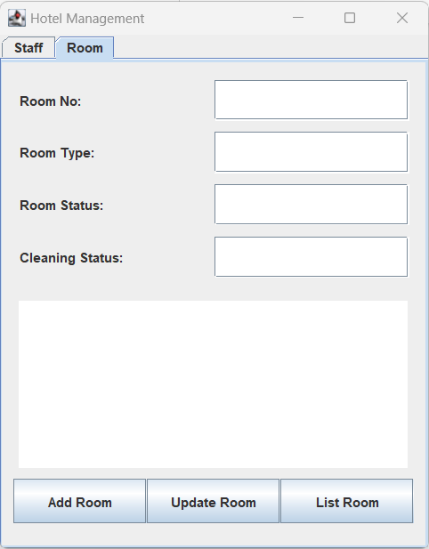

# java_project_house_keeping_management

This repository keeps my code for a simple house keeping management application.

I write the code using Java and MySQL following the UML diagram below

Following are some screenshots of my application.

## Staff management

## Room management

